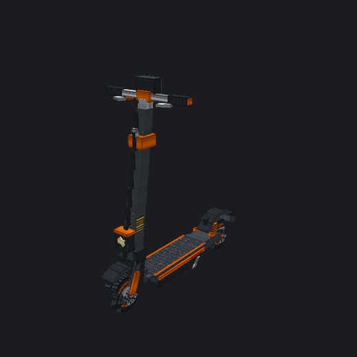
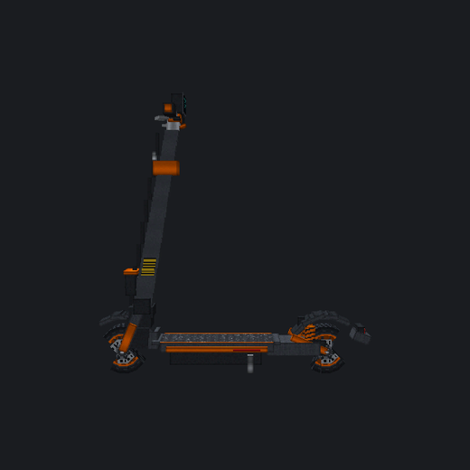
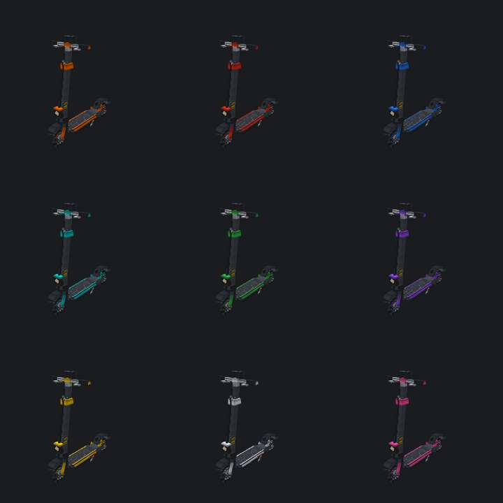

# ScooterMC

Rideable electric scooters for **Paper 1.21.11**, modelled on a **KuKirin G2 Pro**.

You stand on the deck, kick off, thumb the throttle and ride. The scooter is a real 3D model under
your feet with wheels that spin at the right rate, a fork and handlebars that steer, a headlight
that lights the road, and a synthesised brushless-motor note whose pitch and load follow the
throttle.

<p align="center">
  
  
</p>

<p align="center">
  
</p>

<sub>Rendered from the generated models by `tools/preview.py`, the same software renderer used to
verify the geometry.</sub>

---

## What it does

**Riding**

- The rider **stands** — never a sitting passenger — with the scooter drawn under their feet.
  (Minecraft freezes limb animation only for passengers, so a standing rider's legs still swing;
  see [docs/RESEARCH.md §9](docs/RESEARCH.md) for why standing and still legs are mutually
  exclusive.)
- **Zero-start lock**, like a real controller: the throttle stays dead until you are already
  rolling, so you have to kick off first.
- Three drive modes with the real machine's figures: **ECO 20 / DRIVE 40 / SPORT 45 km/h**.
- Speed-dependent steering: at 45 km/h you get 45 % of the steering authority you have at walking
  pace, so it understeers the way a real scooter does.
- Acceleration tapers into a drag-limited top speed rather than hitting a wall.
- Gradients matter, and above the rated **19°** climb the motor loses the fight.
- Braking to the manufacturer's spec: **11.8 m from 45 km/h**, inside the quoted 5–12 m.
- Kerb hops, suspension thumps on landing, reduced fall damage, crashes when you hit a wall hard.
- Water stalls the motor — the real thing is IP54, which covers splashes, not immersion.

**The machine**

- **748.8 Wh** battery (48 V × 15.6 Ah) with a genuine **58 km** range in DRIVE, plus headlight and
  controller draw.
- Odometer, low-battery warning, lockable to its owner, **nine paint colours**.
- Folds into an item that keeps its charge, mileage, paint and lock state.

**Presentation**

- Eight-part articulated rig: frame, steering column, handlebars, dash, both lamps and two
  wheels. The whole column turns on the raked steering axis, as on the real machine.
- Head- and tail-lamps and the dash genuinely glow; the headlight throws light on the road using a
  **client-side-only** light block, so it can never modify or grief the world.
- Eighteen synthesised sound effects — motor, tyre roll, brakes, regen, horn, bell, kick-off,
  crash, power up/down, low battery, and more.
- Action-bar dash with speed, a battery gauge, drive mode and headlight state; optional boss bar.

**Server side**

- Full **English and Polish**, switchable server-wide *and* per player.
- Everything tunable from `config.yml`, all values range-checked on load.
- Brigadier commands with proper per-argument tab completion.
- Flat-file storage with atomic saves; display entities are non-persistent, so a crash cannot leave
  orphaned entities lying around.
- Built-in self-test (`/scooter selftest`) that proves the renderer works on your server build.

---

## Installing

1. Drop `ScooterMC-1.0.0.jar` into `plugins/` and start the server.
2. On first run it writes `plugins/ScooterMC/resourcepack.zip` and logs its SHA-1.
3. Give players the resource pack — **without it the scooter has no model and no sound.** Either:

   **Host it yourself** (recommended)

   ```yaml
   resource-pack:
     enabled: true
     url: "https://your.host/scootermc.zip"
     sha1: "<the SHA-1 the plugin logged>"
   ```

   **Or let the plugin serve it** — fine for a private or test server, plain HTTP:

   ```yaml
   resource-pack:
     enabled: true
     built-in-server:
       enabled: true
       port: 8123
       public-address: "your.server.address"   # must be reachable by players
   ```

4. `/scooter give <player>` and ride.

Java 21 and Paper 1.21.11 (or a later 1.21.x) are required.

---

## Controls

| Key | Action |
| --- | --- |
| **W** | throttle |
| **S** | brake, then walk-assist reverse |
| **A / D** | steer (mouse look steers too) |
| **Space** | kick off when stopped, hop a kerb when rolling |
| **Scroll wheel** | select ECO / DRIVE / SPORT |
| **F** | headlight |
| **Shift** | step off |
| **Right-click** | horn |
| **Left-click** | bell |

Right-click a parked scooter to ride it. Sneak and right-click (or left-click) to fold it
back into an item, keeping its charge, mileage, paint and lock state.

---

## Commands

`/scooter`, aliases `/sc` and `/scootermc`.

| Command | Does | Permission |
| --- | --- | --- |
| `/scooter give <players> [colour]` | hand out a scooter item | `scootermc.command.give` (op) |
| `/scooter spawn [colour]` | place one where you stand | `scootermc.command.spawn` (op) |
| `/scooter list [player]` | where your scooters are | `scootermc.command.list` |
| `/scooter info` | details of the one you are on or near | `scootermc.command.info` |
| `/scooter tp <id>` | go to one of yours | `scootermc.command.tp` |
| `/scooter charge [percent]` | top the battery up | `scootermc.command.charge` (op) |
| `/scooter paint <colour>` | respray | `scootermc.command.paint` |
| `/scooter lock` / `unlock` | stop others riding it | `scootermc.command.lock` |
| `/scooter remove <id>` | delete one | `scootermc.command.remove` |
| `/scooter clear [player]` | delete all of someone's | `scootermc.command.clear` |
| `/scooter pack [players]` | offer the resource pack | `scootermc.command.pack` |
| `/scooter lang <en\|pl\|reset>` | your own message language | `scootermc.command.lang` |
| `/scooter diagnose` | live rig and pack status | `scootermc.admin` |
| `/scooter selftest` | verify rendering on this build | `scootermc.admin` |
| `/scooter reload` | reload config and languages | `scootermc.command.reload` (op) |

`scootermc.admin` grants everything, plus access to other players' scooters.
`scootermc.limit.bypass` ignores the per-player limit.

Colours: `orange` (stock), `red`, `blue`, `cyan`, `green`, `purple`, `yellow`, `white`, `pink`.

---

## Configuration

`config.yml` is commented throughout and every value is validated and clamped on load, so a typo
degrades to a sane default with a warning rather than breaking the ride. The parts most worth
touching:

| Setting | Default | Notes |
| --- | --- | --- |
| `language` | `en` | `en` or `pl`; add your own `lang/<code>.yml` |
| `modes.*.max-speed-kmh` | 20 / 40 / 45 | the real machine's three modes |
| `ride.kick-start.enabled` | `true` | the zero-start safety lock |
| `ride.brake-deceleration` | `6.6` | m/s²; below ~6.5 you miss the quoted stopping distance |
| `ride.steering.speed-falloff` | `0.55` | how much steering is lost at top speed |
| `battery.capacity-wh` | `748.8` | 48 V × 15.6 Ah |
| `render.vertical-offset` | `0.0` | sink the scooter; the deck top is 165 mm, so 0 leaves the wheels on the ground and the rider's feet ~2.5 texels into the deck |
| `hud.units` | `kmh` | or `mph` |

Messages are [MiniMessage](https://docs.advntr.dev/minimessage/format.html) in
`plugins/ScooterMC/lang/`. Drop in `fr.yml` and players can pick it with `/scooter lang fr`.

---

## Building

```bash
mvn clean package          # -> target/ScooterMC-1.0.0.jar
                           #    target/ScooterMC-ResourcePack.zip
```

Maven zips `resourcepack/` into the jar, so a plain clone builds a self-contained plugin with no
Python needed.

### Regenerating the models and sounds

The resource pack is **generated, not hand-drawn**. `tools/scooter_geometry.py` describes the
scooter in real millimetres against the KuKirin spec sheet; the generators turn that into models,
procedurally painted textures and synthesised audio, and emit `assembly.json` so the Java rig and
the models can never drift apart.

```bash
pip install numpy pillow soundfile

python3 tools/measure_reference.py photo.jpg --height-mm 1315   # proportions from a photo
python3 tools/gen_models.py      # models, textures, item definitions, assembly.json
python3 tools/gen_sounds.py      # 18 OGG effects + sounds.json + subtitles
python3 tools/preview.py --check # verify the rig maths
python3 tools/preview.py         # render build/preview/*.png
```

The shape itself came from measuring a manufacturer studio photo rather than guessing — stem rake,
deck height, wheel placement and where the accents sit. `tools/measure_reference.py` does that
measuring, and [docs/RESEARCH.md §8](docs/RESEARCH.md) records what it changed.

`tools/preview.py` is a small software renderer. It reads the generated models exactly the way the
game does and rasterises them, which is how the geometry gets checked without a Minecraft client.
`--check` asserts that the articulated rig reproduces the reference model to within a few microns
and that steering and wheel roll actually move the right parts.

---

## How it works

Some of it is not obvious, and the reasoning is written up in **[docs/RESEARCH.md](docs/RESEARCH.md)**:

- why the rider is driven by velocity packets instead of being a passenger, and the client bytecode
  proving player input is delivered outside a vehicle;
- why the rig hangs its parts off the player in a chain, and why walk speed is zeroed rather than
  the movement-speed attribute (the latter halves the rider's field of view);
- the exact UV convention taken from `FaceBakery.defaultFaceUV`, which is what lets textures be
  painted from each texel's true position on the scooter;
- how a 16-gon wheel is built out of four rotated boxes;
- how a looping motor sample is kept seamless and re-triggered in step with its pitch.

---

## Testing

```bash
mvn test                          # 16 tests: top speed, braking distance, quoted range,
                                  # angle wrapping, gravity, energy, audio timing
python3 tools/preview.py --check  # rig geometry
```

In game, `/scooter selftest` spawns and removes a probe scooter and a display chain and reports
whether the renderer works on your server build.

`tools/ridetest/` is a scripted protocol client that plays a whole ride against a running server:
it mounts, kick-starts, reaches speed, selects every drive mode, toggles the headlight, sounds the
horn, steers, brakes, dismounts, folds the scooter into an item and puts it back down — then
asserts it actually moved and that nothing crashed spuriously.

```bash
cd tools/ridetest && npm install
# with a server on 127.0.0.1:25565 in offline mode, and the bot op'd
node ridetest.js
```

---

## Compatibility notes

- The scooter's look comes from the `minecraft:item_model` component (1.21.4+). Without the
  resource pack, players see the base item and hear nothing — everything else still works.
- The headlight sends a light block to clients only. It never writes to the world.
- Riders have their walk speed set to zero. It is restored on dismount, disconnect, death, world
  change, plugin disable and on join, so a crash cannot leave anyone frozen.
